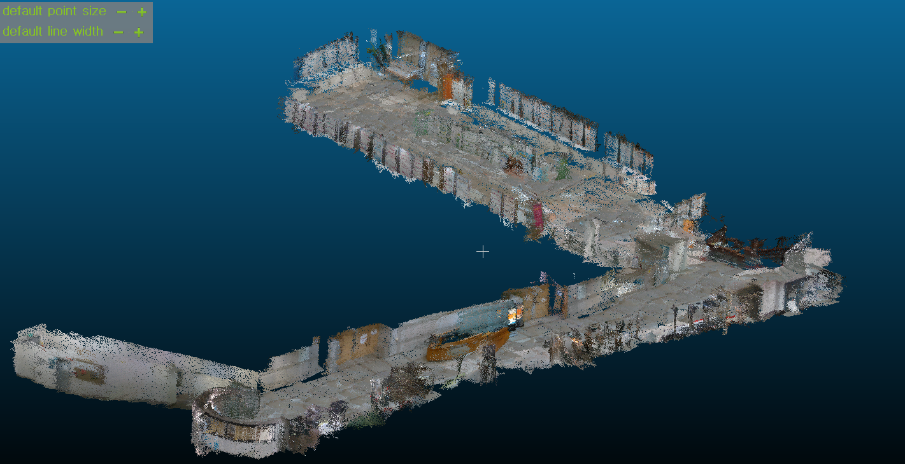
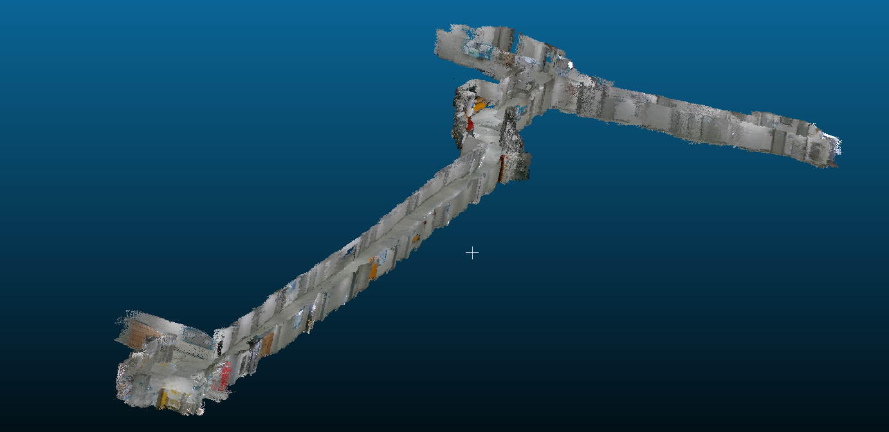
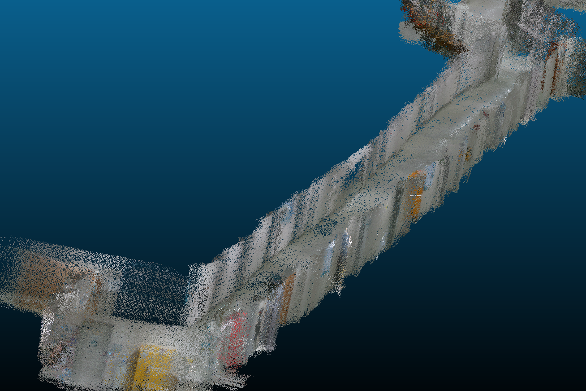

# Unanimous
 * 숭실대학교 스마트시스템소프트웨어학과 재학생끼리 계획한 통합실내지도 솔루션을 제공하기위한 프로젝트 입니다.

## Unanimous v1
 * unanimous 초기버전
 * rtabmap_ros, realsense_ros 패키지와 라이브러리가 추가로 필요하다.
 
## Hardware
 * raspberry pi 4
 * turtle - 2wd mobile platform
 * Li-op battery
 * realsense D435
 * rplidar a1
 
## Explanation (요약)
 1. 2륜 mobile robot을 이용하여 자율주행 시스템을 탑재한다.
 2. 자율주행 시스템을 위한 slam알고리즘 구동을 위한 센서들을 부착한다.
 3. 로봇에 장착된 realsense D435를 이용하여 point cloud map을 만든다.
 4. 모든 센서와 로봇간의 TF정보를 설정하고, odometry를 이용하여 값을 보정한다.
 5. 최종적으로 만들어진 point cloud map을 사용자들에게 제공하고, 경로안내 시스템을 구현한다.
 
## Run
 * 자율주행을 위한 런치파일이다.
```sh
$ roslaunch total_launch total_launch.launch --screen
``` 

 * realsense D435를 구동하기 위해 작성한 메뉴얼 입니다.
 ```sh
# if realsense-ros does not exist, you should read this menual.
$ cd ../src
$ git clone https://github.com/IntelRealSense/realsense-ros.git

# ddynamic_reconfigure package install
$ cd ../src
$ git clone https://github.com/pal-robotics/ddynamic_reconfigure.git

# realsense SDK install
$ cd
$ git clone https://github.com/IntelRealSense/librealsense.git
$ cd ~/librealsense
$ mkdir build
$ cmake ..
$ make -j4
$ sudo make install

# rtabmap install. (if ROS is already installed on ubuntu 16.04)
$ sudo apt-get update
$ sudo apt-get install libsqlite3-dev libpcl-dev libopencv-dev git cmake libproj-dev libqt5svg5-dev

## Not working rtabmap which is must installed with opencv3.xx

# rtabmap library download
$ cd
$ git clone https://github.com/introlab/rtabmap.git
$ cd rtabmap/build
$ cmake ..
$ make -j4
$ sudo make install

# rtabmap-ros package install
$ cd ../src
$ git clone https://github.com/introlab/rtabmap_ros.git

# installation realsense2 D435 firmware
https://dev.intelrealsense.com/docs/firmware-update-tool?_ga=2.88126104.203762601.1566118510-1030599472.1566118510

# launch mapping
$ roslaunch realsense2_camera rs_aligned_depth.launch
$ roslaunch rtabmap_ros rtabmap.launch rtabmap_args:="--delete_db_on_start" depth_topic:=/camera/aligned_depth_to_color/image_raw rgb_topic:=/camera/color/image_raw camera_info_topic:=/camera/color/camera_info
``` 
## Result
 1. 숭실대학교의 한경직기념관 1층 pointcloud map을 unanimous_v1 로봇으로 만든 모습이다. 


 2. 숭실대학교의 형남공학관 4층 pointcloud map을 unanimous_v1 로봇으로 만든 모습이다.


 3. 2번 pointcloud map을 확대한 사진이다.
 
 
# Unanimous v2
```sh
$ roslaunch lidar_detect qt_detect_launch.launch --screen
``` 
# Reference
https://www.youtube.com/watch?v=rWDjQ4hLrtE&t=14s
