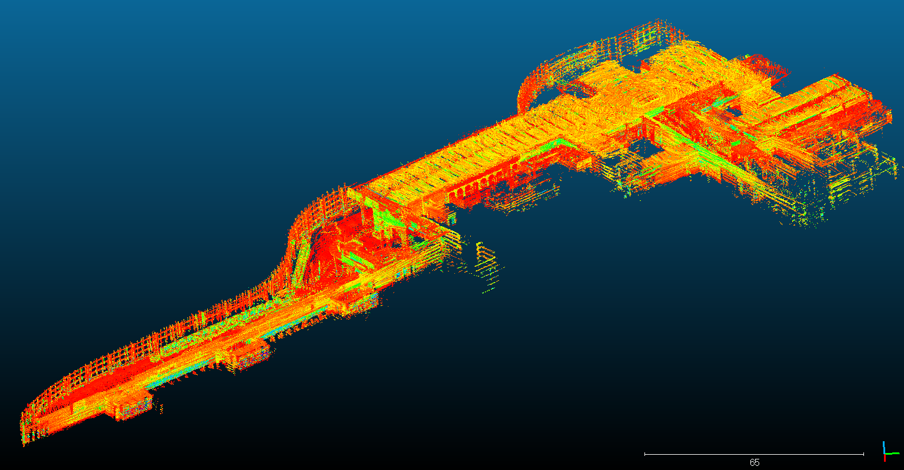
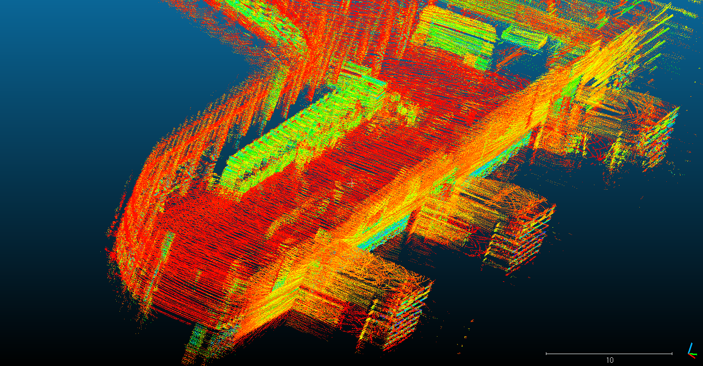
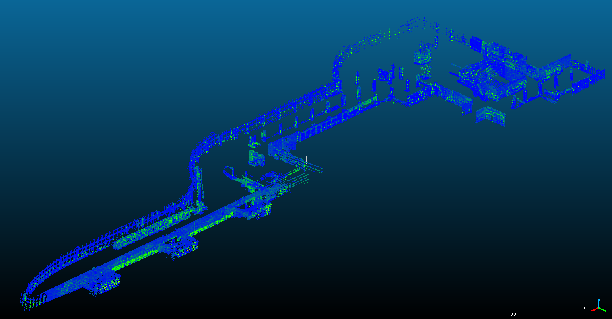
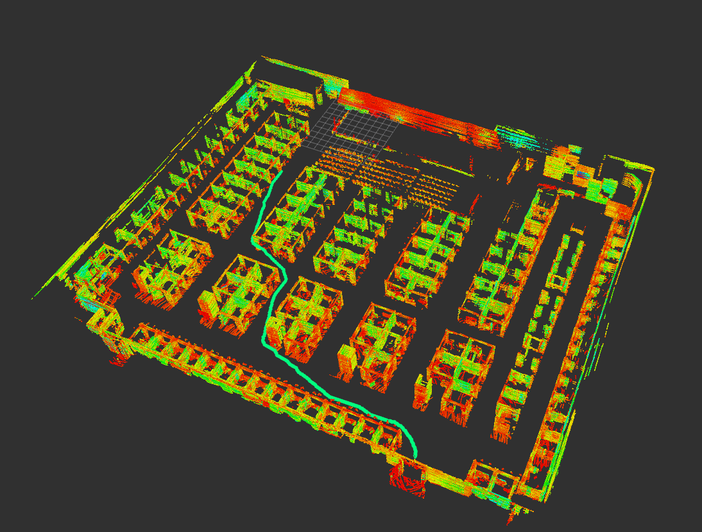
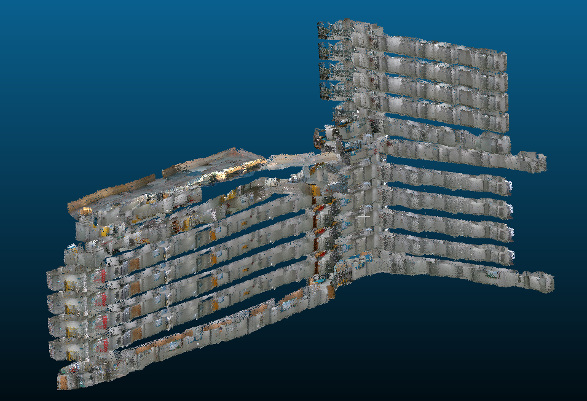

# Unanimous
 * 숭실대학교 스마트시스템소프트웨어학과 재학생끼리 계획한 통합실내지도 솔루션을 제공하기위한 프로젝트 입니다.

# Unanimous v1
 * unanimous 초기버전
 * rtabmap_ros, realsense_ros 패키지와 라이브러리가 추가로 필요하다.
 
## Hardware
 * raspberry pi 4
 * turtle - 2wd mobile platform
 * Li-po battery
 * realsense D435
 * rplidar a1
 
## Explanation (요약)
 1. 2륜 mobile robot을 이용하여 자율주행 시스템을 탑재한다.
 2. 자율주행 시스템을 위한 slam알고리즘 구동을 위한 센서들을 부착한다.
 3. 로봇에 장착된 realsense D435를 이용하여 point cloud map을 만든다.
 4. 모든 센서와 로봇간의 TF정보를 설정하고, odometry를 이용하여 값을 보정한다.
 5. 최종적으로 만들어진 point cloud map을 사용자들에게 제공하고, 경로안내 시스템을 구현한다.
 6. 숭실대학교 몇개의 건물들의 실내구조를 RGB-D 속성의 point cloud map으로 만들어서 서비스
 
## Run
 * 자율주행을 위한 런치파일이다.
```sh
$ roslaunch total_launch total_launch.launch --screen
``` 

 * realsense D435를 구동하기 위해 작성한 메뉴얼 입니다.
 ```sh
# if realsense-ros does not exist, you should read this menual.
$ cd ../src
$ git clone https://github.com/IntelRealSense/realsense-ros.git

# ddynamic_reconfigure package install
$ cd ../src
$ git clone https://github.com/pal-robotics/ddynamic_reconfigure.git

# realsense SDK install
$ cd
$ git clone https://github.com/IntelRealSense/librealsense.git
$ cd ~/librealsense
$ mkdir build
$ cmake ..
$ make -j4
$ sudo make install

# rtabmap install. (if ROS is already installed on ubuntu 16.04)
$ sudo apt-get update
$ sudo apt-get install libsqlite3-dev libpcl-dev libopencv-dev git cmake libproj-dev libqt5svg5-dev

## Not working rtabmap which is must installed with opencv3.xx

# rtabmap library download
$ cd
$ git clone https://github.com/introlab/rtabmap.git
$ cd rtabmap/build
$ cmake ..
$ make -j4
$ sudo make install

# rtabmap-ros package install
$ cd ../src
$ git clone https://github.com/introlab/rtabmap_ros.git

# installation realsense2 D435 firmware(web site)
https://dev.intelrealsense.com/docs/firmware-update-tool?_ga=2.88126104.203762601.1566118510-1030599472.1566118510

# launch mapping
$ roslaunch realsense2_camera rs_aligned_depth.launch
$ roslaunch rtabmap_ros rtabmap.launch rtabmap_args:="--delete_db_on_start" depth_topic:=/camera/aligned_depth_to_color/image_raw rgb_topic:=/camera/color/image_raw camera_info_topic:=/camera/color/camera_info
``` 
## Result
 1. 숭실대학교의 한경직기념관 1층 pointcloud map을 unanimous_v1 로봇으로 만든 모습이다. 


 2. 숭실대학교의 형남공학관 4층 pointcloud map을 unanimous_v1 로봇으로 만든 모습이다.


 3. 2번 pointcloud map을 확대한 사진이다.
 
 
# Unanimous v2
 * unanimous v1를 수정 보완한 프로젝트.
 * raspberry pi4에 ROS를 포팅해야한다. (현재 우분투를 지원하지 않음)
 * velodyne, turtlebot3의 추가 패키지가 필요하다.
 * 기존 pointcloud map을 만들때 realsense D435를 사용하였지만, v2에서는 velodyne VLP16 LiDAR를 사용함.
 * 하드웨어도 전부 새로 설계한 프로젝트이다.

## Hardware
 * raspberry pi 4
 * turtlebot3 waffle
 * 40800mAh AC 220V sub battery (2ea)
 * Velodyne VLP 16channel LiDAR
 * Asus x560U laptop

## Explanation (요약)
 1. 기존 mobile robot의 모터의 회전힘의 부족으로 인한 문제점을 보완하기 위해 waffle사용.
 2. velodyne VLP16 LiDAR로 실내구조를 스캔하기위해 로봇플랫폼을 변경.
 3. ndt_mapping의 loopclosing 문제를 해결하기위해 graph based slam알고리즘으로 보정함.
 4. 반복적인 구조의 고층건물을 쉽게 스캔하기위해 구간별 2d map을 작성하고, 자율주행으로 맵을 스캔함.
 5. mapping 알고리즘이 고사양을 요구하기 때문에 rosbag을 이용하여 raspberry pi에 LiDAR data를 저장후 노트북으로 처리.
 6. 현재 숭실대학교 교정 pointcloud map과 몇몇의 건물의 pointcloud map을 합쳐서 제공중.
 7. 대회를 위한 강남 코엑스, 세종대 광개토홀의 실내지도도 서비스 가능.
 8. 고정밀 3차원 실내지도 이기 때문에 많은 응용분야에 적용가능.
 9. 서버를 구동하여 3차원 실내지도를 사용자들에게 시각화서비스를 제공함.
 10. 건물 내부 네비게이션 서비스 뿐만아니라, 건물 → 건물 path finding 서비스 제공 중.
 11. 실제 실내 건물구조와 오차율은 0.1% 이내이다.
 
## Run
 ```sh
# make a 2d map for autonomous mobile system
$ roslaunch total_launch 2dMapping.launch

# run turtlebot waffle 
$ roslaunch total_launch total_launch.launch

# record pointcloud data topic
$ rosbag record -o "(file name)" "(topic name)"

# 3d mapping (you have to use rosbag data)
$ roslaunch ndt_mapping ndt_mapping.launch

# if your 3d map has loopclosing, run g2o.
$ roslaunch hdl_graph_slam hdl_graph_slam_centrair.launch

# run rosbag file
$ rosbag play "(your bag file)"
``` 
## Result
 1. 강남 코엑스의 대회장 일부분을 unanimous 프로젝트로 만든 실내지도이다. 


 2. 1번을 자세히 확대한 사진이다.


 3. 강남 코엑스의 바닥과 천장을 제거한 실내지도이다.
 
 
 4. sw 인재페스티벌 대회에 참가하였을때 세종대학교의 광개토홀의 3차원 실내지도이다. 입구부터 unanimous 부스까지 경로를 안내함.
 
 
 5. 현재 서버에서 사용자에게 제공하고있는 숭실대학교의 형남공학관 실내 3차원 지도이다.
 
 
 
# Reference
 ** 관련 기사나, 로봇에대한 자세한정보, 시연영상, 동작영상은 아래 링크를 참조하시면 됩니다.
 
 * https://www.youtube.com/watch?v=rWDjQ4hLrtE&t=14s
 * https://scatch.ssu.ac.kr/%eb%89%b4%ec%8a%a4%ec%84%bc%ed%84%b0/%ec%a3%bc%ec%9a%94%eb%89%b4%ec%8a%a4/page/3/?slug=20058-2&f&keyword
 * http://www.dhnews.co.kr/news/articleView.html?idxno=116170
